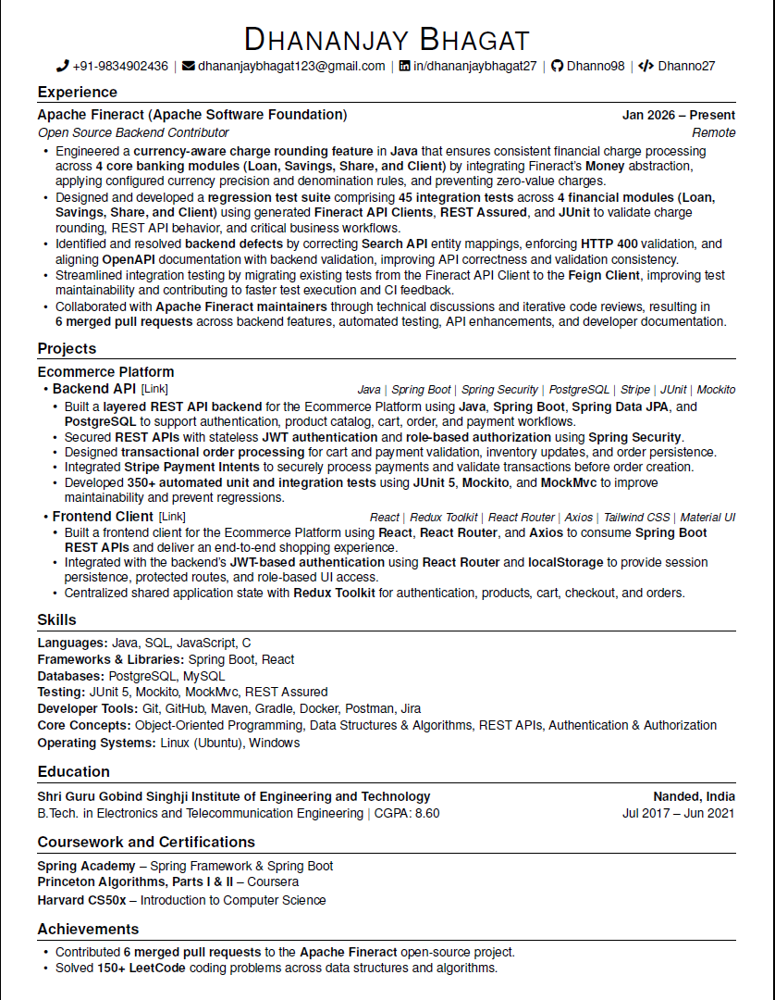

# Dhananjay Bhagat

### Java Backend Developer | Apache Fineract Contributor | Spring Boot | REST APIs | PostgreSQL |

---

## Resume Preview

---

## Download Resume

📄 **Download the latest resume**

➡️ **[Dhananjay_Bhagat_Java_Backend_Resume.pdf](./Dhananjay_Bhagat_Java_Backend_Resume.pdf)**

---

## Source

The LaTeX source used to generate this resume is available in the `source/` directory.

---

Built with LaTeX

